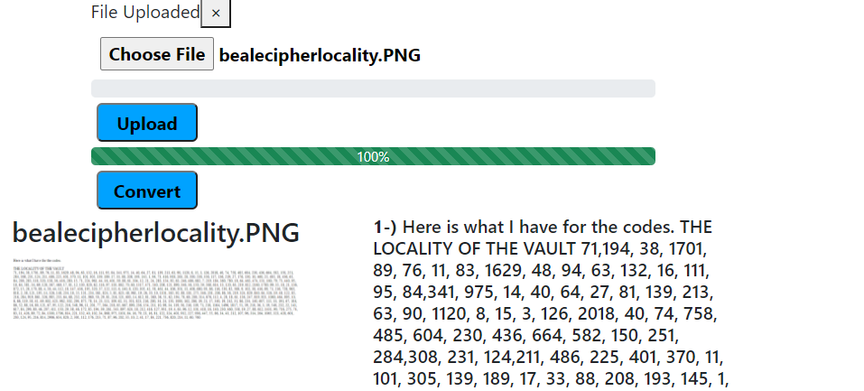

# Getting Started with Create React App OCR

This project was bootstrapped with [Create React App](https://github.com/facebook/create-react-app).

## Setup

RUN yarn install or npm install at the root to retrieve all the dependencies for the node server. 

RUN yarn start or npm start to get your API up and running on http://localhost:3001.

Open a terminal and RUN
### `npm start`

Open a 2nd terminal
 
 cd into `client` and run yarn install or npm install to retrieve the client side dependencies.
 

 RUN yarn start or npm start to fire up your React application.

### `npm start`

The page will reload if you make edits.\
You will also see any lint errors in the console.

## Sample of what App-Ocr does
 Uploads an image and converts said image to text

